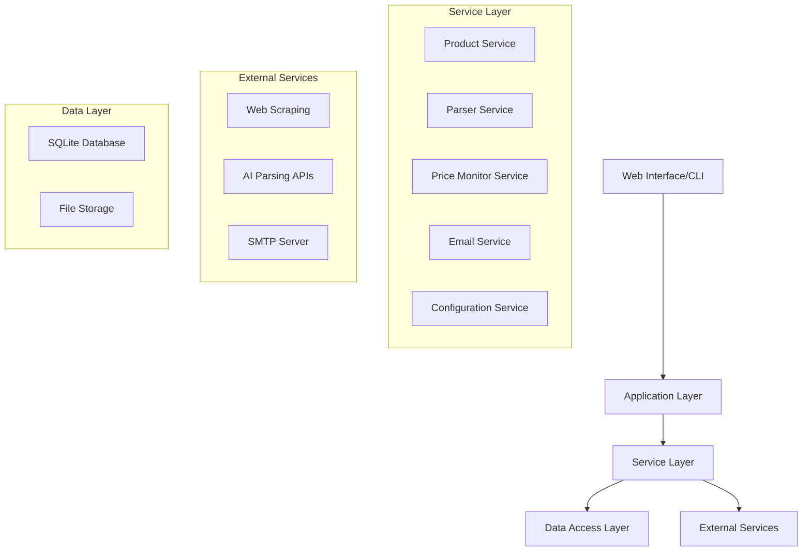

# Design Document

## Overview

The Price Monitor application is a containerized Python-based system that automatically tracks product prices from web URLs. It combines web scraping, AI-powered content parsing, scheduled monitoring, and email notifications to provide comprehensive price tracking functionality. The system uses a modular architecture with clear separation between data parsing, storage, scheduling, and notification components.

## Architecture

The application follows a layered architecture pattern:



### Key Architectural Decisions

1. **SQLite Database**: Lightweight, file-based database suitable for containerized deployment
2. **Modular Services**: Each major functionality is encapsulated in separate service classes
3. **Plugin-based Parsing**: Multiple parsing strategies can be configured and attempted
4. **Configuration-driven**: All settings externalized to property files
5. **Scheduled Execution**: Built-in scheduler for automated price checks
6. **mTLS Security**: Mutual TLS authentication for secure API access and client verification

## Components and Interfaces

### Core Components

#### 1. Product Service (`ProductService`)
- **Purpose**: Manages product CRUD operations and price history
- **Key Methods**:
  - `add_product(url: str) -> Product`
  - `get_product(product_id: int) -> Product`
  - `get_all_products() -> List[Product]`
  - `delete_product(product_id: int) -> bool`
  - `update_price_manually(product_id: int, price: float) -> bool`

#### 2. Parser Service (`ParserService`)
- **Purpose**: Extracts product information from web pages using multiple strategies
- **Key Methods**:
  - `parse_product(url: str) -> ProductInfo`
  - `register_parser(parser: ProductParser) -> None`
- **Parsing Strategies**:
  - HTML/CSS selector-based parsing
  - AI-powered content extraction
  - Structured data (JSON-LD, microdata) parsing

#### 3. Price Monitor Service (`PriceMonitorService`)
- **Purpose**: Orchestrates daily price checks and comparison logic
- **Key Methods**:
  - `check_all_products() -> None`
  - `check_product(product_id: int) -> PriceCheckResult`
  - `schedule_daily_checks() -> None`

#### 4. Email Service (`EmailService`)
- **Purpose**: Handles email notifications for price drops
- **Key Methods**:
  - `send_price_drop_notification(product: Product, old_price: float, new_price: float) -> bool`

#### 5. Configuration Service (`ConfigService`)
- **Purpose**: Loads and validates application configuration
- **Key Methods**:
  - `load_config(config_path: str) -> Config`
  - `validate_config(config: Config) -> bool`

#### 6. Security Service (`SecurityService`)
- **Purpose**: Handles mTLS authentication and certificate management
- **Key Methods**:
  - `load_certificates() -> CertificateBundle`
  - `validate_client_certificate(cert: Certificate) -> bool`
  - `setup_mtls_context() -> SSLContext`

### External Interfaces

#### Web Scraping Interface
```python
class WebScrapingInterface:
    def fetch_page_content(self, url: str) -> PageContent
    def extract_images(self, content: PageContent) -> List[str]
```

#### AI Parsing Interface
```python
class AIParsingInterface:
    def extract_product_info(self, content: str, url: str) -> ProductInfo
    def analyze_price_patterns(self, content: str) -> List[PriceCandidate]
```

## Data Models

### Product Model
```python
@dataclass
class Product:
    id: int
    url: str
    name: str
    current_price: float
    previous_price: Optional[float]
    lowest_price: float
    image_url: Optional[str]
    created_at: datetime
    last_checked: datetime
    is_active: bool
```

### Price History Model
```python
@dataclass
class PriceHistory:
    id: int
    product_id: int
    price: float
    recorded_at: datetime
    source: str  # 'automatic' or 'manual'
```

### Configuration Model
```python
@dataclass
class Config:
    # Database settings
    database_path: str
    
    # Email settings
    smtp_server: str
    smtp_port: int
    smtp_username: str
    smtp_password: str
    recipient_email: str
    
    # Monitoring settings
    check_frequency_hours: int
    max_retry_attempts: int
    request_timeout_seconds: int
    
    # AI/Parsing settings
    ai_api_key: Optional[str]
    ai_api_endpoint: Optional[str]
    enable_ai_parsing: bool
    
    # Security settings
    enable_mtls: bool
    server_cert_path: str
    server_key_path: str
    ca_cert_path: str
    client_cert_required: bool
    api_port: int
```

### Security Models
```python
@dataclass
class CertificateBundle:
    server_cert: str
    server_key: str
    ca_cert: str
    client_certs: List[str]

@dataclass
class AuthenticationResult:
    is_authenticated: bool
    client_id: Optional[str]
    error_message: Optional[str]
```

### Database Schema

```sql
-- Products table
CREATE TABLE products (
    id INTEGER PRIMARY KEY AUTOINCREMENT,
    url TEXT UNIQUE NOT NULL,
    name TEXT NOT NULL,
    current_price REAL NOT NULL,
    previous_price REAL,
    lowest_price REAL NOT NULL,
    image_url TEXT,
    created_at TIMESTAMP DEFAULT CURRENT_TIMESTAMP,
    last_checked TIMESTAMP,
    is_active BOOLEAN DEFAULT TRUE
);

-- Price history table
CREATE TABLE price_history (
    id INTEGER PRIMARY KEY AUTOINCREMENT,
    product_id INTEGER NOT NULL,
    price REAL NOT NULL,
    recorded_at TIMESTAMP DEFAULT CURRENT_TIMESTAMP,
    source TEXT NOT NULL,
    FOREIGN KEY (product_id) REFERENCES products (id)
);
```

## Error Handling

### Error Categories and Strategies

1. **Network Errors**
   - Connection timeouts: Retry with exponential backoff
   - HTTP errors: Log and skip current check, continue with other products
   - DNS resolution failures: Mark URL as temporarily unavailable

2. **Parsing Errors**
   - Invalid HTML: Try alternative parsing methods
   - Missing product information: Log detailed error for manual review
   - Price format errors: Attempt multiple price extraction patterns

3. **Configuration Errors**
   - Missing required settings: Fail fast with clear error messages
   - Invalid email credentials: Test connection on startup
   - Database connection issues: Retry with fallback to in-memory storage

4. **Security Errors**
   - Invalid client certificates: Reject connection with appropriate HTTP status
   - Certificate expiration: Log warning and continue with valid certificates
   - mTLS handshake failures: Log detailed error for certificate troubleshooting

5. **Email Delivery Errors**
   - SMTP authentication failures: Log error and disable notifications
   - Network issues: Queue notifications for retry
   - Invalid recipient addresses: Log error and continue monitoring

### Error Recovery Mechanisms

- **Circuit Breaker Pattern**: Temporarily disable failing parsers or email service
- **Graceful Degradation**: Continue monitoring even if some features fail
- **Comprehensive Logging**: Structured logging for troubleshooting and monitoring
- **Health Checks**: Built-in endpoints for container health monitoring

## Testing Strategy

### Unit Testing
- **Service Layer**: Mock external dependencies, test business logic
- **Parser Components**: Test with sample HTML content and expected outputs
- **Data Models**: Validate data integrity and relationships
- **Configuration**: Test various configuration scenarios and validation

### Integration Testing
- **Database Operations**: Test CRUD operations with real SQLite database
- **Email Service**: Test with mock SMTP server
- **Web Scraping**: Test with mock HTTP responses
- **End-to-End Workflows**: Test complete price monitoring cycle

### Test Data Management
- **Sample Product Pages**: HTML fixtures for different website formats
- **Price History Scenarios**: Test data for various price change patterns
- **Configuration Files**: Test configurations for different deployment scenarios

### Docker Testing
- **Container Build**: Automated testing of Docker image creation
- **Configuration Mounting**: Test external configuration file mounting
- **Health Checks**: Verify container health check endpoints
- **Resource Usage**: Monitor memory and CPU usage during operation

### Performance Testing
- **Concurrent Processing**: Test handling multiple product checks simultaneously
- **Large Dataset**: Test performance with hundreds of monitored products
- **Memory Usage**: Monitor memory consumption during long-running operations
- **Database Performance**: Test query performance with large price history

## Deployment Architecture

### Docker Container Structure
```
/app
├── src/
│   ├── services/
│   ├── models/
│   ├── parsers/
│   ├── security/
│   └── main.py
├── config/
│   └── default.properties
├── certs/
│   ├── server.crt
│   ├── server.key
│   ├── ca.crt
│   └── client-certs/
├── data/
│   └── database.db
├── logs/
└── requirements.txt
```

### mTLS Security Architecture

#### Certificate Management
- **Server Certificate**: Used by the application to identify itself to clients
- **Client Certificates**: Required for client authentication and authorization
- **Certificate Authority (CA)**: Used to validate both server and client certificates
- **Certificate Rotation**: Support for certificate updates without service restart

#### API Security
- **HTTPS Only**: All API endpoints require TLS encryption
- **Client Certificate Validation**: Every API request must present a valid client certificate
- **Certificate-based Authorization**: Different client certificates can have different access levels
- **Secure Headers**: Implementation of security headers (HSTS, CSP, etc.)

### Configuration Management
- **External Mounting**: Configuration files mounted from host system
- **Environment Variables**: Override specific settings via environment variables
- **Validation on Startup**: Comprehensive configuration validation before service start
- **Hot Reload**: Support for configuration updates without container restart

### Monitoring and Observability
- **Structured Logging**: JSON-formatted logs for easy parsing
- **Health Endpoints**: HTTP endpoints for container health checks
- **Metrics Collection**: Basic metrics on parsing success rates and email delivery
- **Error Alerting**: Critical error notifications via email or logging systems